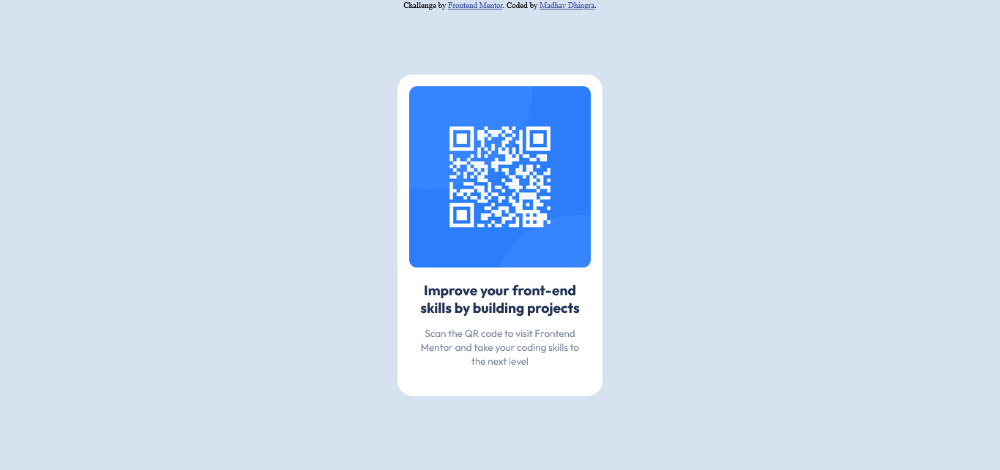

# Frontend Mentor - QR code component solution

This is a solution to the [QR code component challenge on Frontend Mentor](https://www.frontendmentor.io/challenges/qr-code-component-iux_sIO_H). 

## Table of contents

- [Screenshots](#screenshots)
- [Link](#link)
- [Built with](#built-with)
- [Platform used](#platform-used)
- [What I learned](#what-i-learned)
- [Author](#author)
- [Acknowledgment](#acknowledgment)

## Screenshots

###  Desktop

### Mobile

## Link
Live Site URL: [Click here](https://dhingra-madhav.github.io/QR-code-component/)

## Built with

- HTML
- CSS

## Platform used
VS Code

## What I learned

By working on this project, I learnt about the basic features of HTML and CSS.

## Author

Frontend Mentor - [Madhav Dhingra](https://www.frontendmentor.io/profile/dhingra-madhav)

## Acknowledgment

I would like to thank my batchmates [Vaibhav](https://github.com/Vaib215) and [Pranay](https://github.com/masterpranay1) for constantly supporting and encouraging me in my web development journey.

